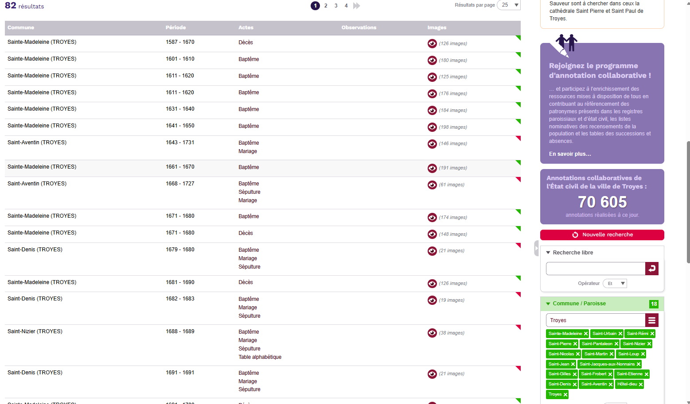

# Worklog

## 02-23-2026
Projects: Aube - Saint Etienne Civil Status Scrappers

I have finished scraping the Aube2 and Creuse Civil Status records. I have found some inconsistancies with the data though. Using my validate_csv.py script I can see how many duplicates and null values. 
#### Aube2 
Looking at Aube2 there is some fishy looking stuff going on. The website is inconsistant with how many records it has, so it's hard to say what the true record count is. Perhaps it contains records that do not have communes?
#### Creuse
This scraper seems to have simply failed because the website has a bug. If you flip through the pages too fast for too long it stops updating the records it displays. Creuse hit this problem about on page 400. So this record can be repaired by simply reruning the scraper with a filter on the date.

This let to an interesting discovery though. The website url contains information that you can use to set the page number. So instead of clicking buttons I can just load a webpage with a modified url for a lot of things. This can be more reliable because it allows me to skip to what ever page number I want. I imagine it would be slower for most things though. However that is still a better way than what I am currently doing. Being able to directly index to a spot is more important. Also the current function has a O(n) where as the new function would be O(1). The current function probably takes much longer than loading the page from scratch for for n > 10 and in Creuse we got up to n = 400.

#### Other Scrapers
I think that any time I find an error in one scraper I should solve that and verify that that same error doesn't exist in all of them before I get too far into them. That way I don't risk redoing so much work. I find it likely that there are errors in the Aube scrapper that are really hard to detect but are much more obvious in different data. I would like to get more of a shared code base going. I think I am going to have Jules task a look at it. That means I should put my work folder on git, I am not sure what the policy for that is so I will as my team lead. The shared code would help allow for shared patches.
- I probably want to make a class that is an instance of a scrapper.
- That class will have fields for the constants that I stick at the begining of the file.
- It would be good to set it up for async.
- It would also be good to create test files

#### Scaling and Automating
The problem with some of these things is that I just don't know if this is a big enough of a problem to justify making a scraping suite. Like yes I would avoid breaking the other scrapers by setting up tests, but do I really need to? Likely that is not going to be something used by future TAs. Now, perhaps there is a different perspective. If I can build a system that generalizes the workflow to the point that I can automate my job that would be very valuable. I just don't know if I am going to be able to generalize it that well.

It would be pretty sweet to have an automated validation system that ensure high quality data. That shouldn't be too hard. My validation script is pretty decent for catching problems as is. That should remain hard coded. Then the process for writing web scapers isnt' like crazy unique. I bet that if I made a really detailed [skill](https://docs.openclaw.ai/tools/skills), I could get an agent to write the scapers. It would have to be pretty precise

If I was at a company I would feel like that sort of a project would not be worth the time, but this is a research lab for heavens sakes, we are supposed to be discovering new ways to do stuff. A good first step would be to document out the proccess of making a scraper very throughoutly. In order to write the skill I think that I would need to have a of the "tricks of the trade" figured out. Also I need to have genralized this scraper set up really well before I can try and genralize scraping records.

Some questions that I would need to answer are:
- What are the things that all genelogical scrapers have in common?
    - They all download a bunch of images.
    - They all have to follow a sequence of scraper interactions to reach that spot.
- How can I deterministically find all of the short cuts?
    - How can we find the shortest path to the link?
    - The Aube records have a [pattern](Aube_Civil_Status/aube_civil_status_by_commun.py) with how the links are stored. How can we find and exploit those patterns?

#### Testing Liberary
I think that I really do need to make some testing tools.
    
#### TODO:
- [x] Ask Makala about Github and run the idea about automating writing scrapers with an agent
- [x] Write an improved jump_to_page(). And rerun [Creuse](Creuse_Civil_Status/creuse_link_collector.py)
- [x] Refactor [Aube_style_scraper](Utilities/Aube_style_scrapper_base.py) to use a class
(V:\FHSS-JoePriceResearch\papers\current\french_records\RA_work_folder\department_scrapers\type_1_obsolete\dordogne_integrated.py) didn't run into the same problems I am. I am going to be honest, I am starting to think that there are a ton of mistakes in these scrapers. 

#### Discoveries
- The type 1 websites, I believe are all based on same underlying software platform called Arkaïe (developed by the company [Arkhenum](https://www.arkhenum.com/))
- With Arkaïe type pages you can inject search parameters with the url.
- The reason the scraper failed was not because it stops refreshing if you change page too far too fast, The framework has cannot handle numbers for from higher than 9975. They only give it four digits to opperate in. Even if you are manually clicking slowly, it cannot update to a record on a page higher than 400.
- It really is failing because their system cannot display more than 9999 records.
- We can not locate the Dordogne Census scrape results.
- Aube claims to have 13247 records. If you count up the results for each commune you get 6946. That's less than half of the data. This means that you can't get all of the records by searching by commune. If there was an xor filter you could find all the unclassified records, however this doesn't exist. 
- A bit better was looking at the record type and then using except Marriages and then except everything else. That way you can split up the data into workable chunks, it still doesn't account for all of the data.
- Okay so I think the actually correct way to use the filters is to do a and [some_field] then except [some_field].
- Techniques for finding missing records. Look for gaps in the Cotes and years. Those spots are most likely to be missing data.

## 02-25-2026

I have created the general scrapper now I just need to refactor all of the other scrapers to use it. 
### Quality Assurance
I think one modification that I need to make is to store a record number in the CSV file. That would allow for quick easy validation. Then I could create a test script that checks to see if it can find the records of the first last and 3 in the middle. That would ensure that the indexes remain consitant. Then if the indexes break, I can do a bianary search to find the missing record. That would be quick enough. 
    
Test Cases:
- We have the same number of records as the site advertizes
    - Or can explain the difference with data. IE a list of all the records missing values
- All instances are unique
- Records can be reverse indexed.
    - If you have the CSV file there is a easy way to find the source for the data.

### Updated Pipeline
- {name}_scraper -> {name}.csv
- tests -> Results
If the tests show that we have all of the data skip the cleaning step
- clean
    - Deduplicate
    - Find missing values
- Reformat -> CSV: file_name|individual_link
    - Remove page and index columns
    - Combine certain feilds to create a name
    - Create a unique link for each image in the image count
- Dowload each file
    - Path: W:\papers\curent\french_records\french_record_images\{Department (Name)}\{Record_types}\{Commune}\{Period}\{Department}_{Record_types}_{Commune}_{Batch}_{page}
    - Piefx adds
        - Title : Cote - Period
        - Subject: Cote - Period
        - Copywright: Slug url
    - Path: W:\papers\current\french_records\french_record_images\Cote_do'r\census\Agencourt\1841

### Census Scrapers
I confirmed that at least one of the census scrapers was not set up to handle +10000 records. That means they at least missed 1304 records.
That leads me to believe that there are other problems with the scrapers as well. Now it would be much easier to verify this if we could 
actually look for through the images. I don't think any QA was done in the census scraping so I personally think it should be redone completely.
Once I have a good scraping suite set up it shouldn't be that hard. The same scrapers will run on the census sites I believe.

### Discoveries

Even though et means "and" the department names with et and without et are actually differnet departments

## 02-26-2026

### Aube2
There were a few errors still in the Aube2 scraper that I had to work out.

### +20000 problem
If I choose a feature and then filter for and and except I can split the data set in two. Makayla sugested the original Aube2 approach which just filtered by commune. This method has some complexities though. If you search up the commune there is overlap some times. Also there are records that are not listed under one of those filters. These can be found by filtering for all the communes with except.

This shows that being applied in Aube2. There are 82 records that do not show under their filters but are actually labeled. Using the [[Temp/examine.py]] I can verify that we do indeed have all of the records accounted for if we include those last 82. This means that this approuch is valid at least for aube2. To run a scrape filtered by commune, we need to rely on the table over the filter qualification.