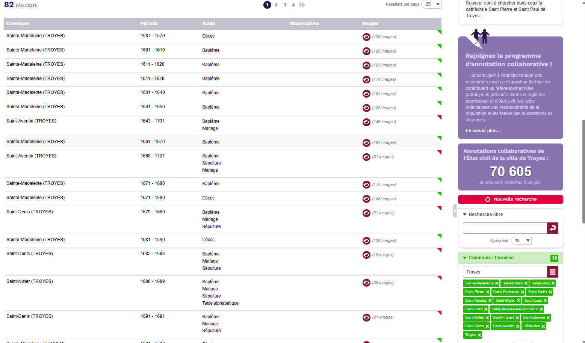
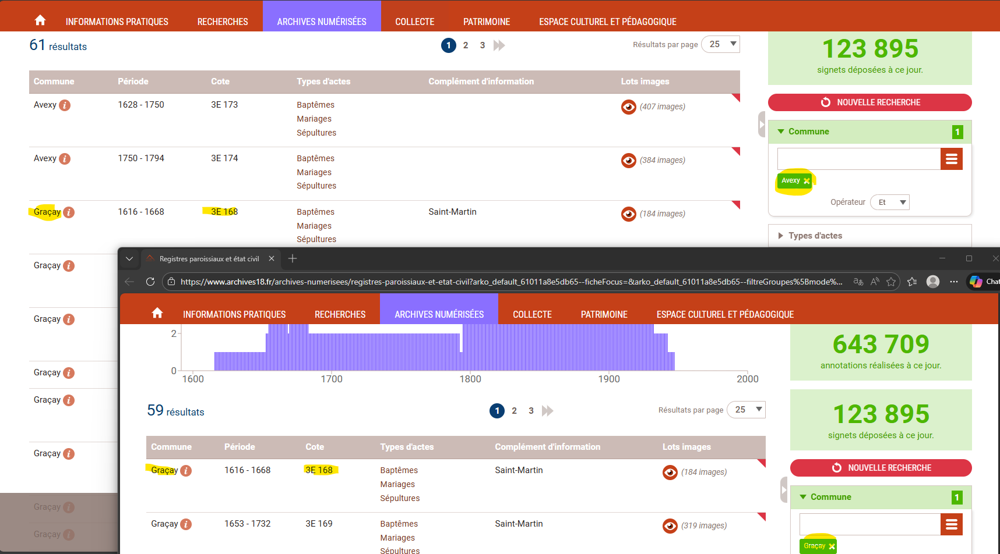
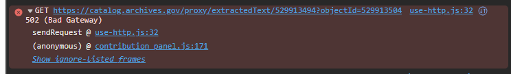
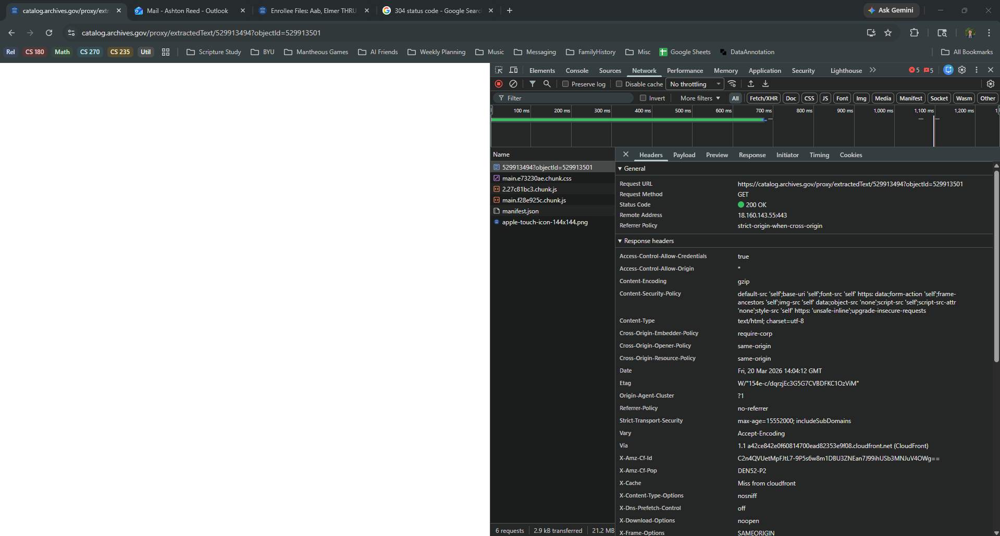

# Worklog

## 02-23-2026

Projects: Aube - Saint Etienne Civil Status Scrappers

I have finished scraping the Aube2 and Creuse Civil Status records. I have found some inconsistancies with the data though. Using my validate_csv.py script I can see how many duplicates and null values.

#### Aube2

Looking at Aube2 there is some fishy looking stuff going on. The website is inconsistant with how many records it has, so it's hard to say what the true record count is. Perhaps it contains records that do not have communes?

#### Creuse

This scraper seems to have simply failed because the website has a bug. If you flip through the pages too fast for too long it stops updating the records it displays. Creuse hit this problem about on page 400. So this record can be repaired by simply reruning the scraper with a filter on the date.

This let to an interesting discovery though. The website url contains information that you can use to set the page number. So instead of clicking buttons I can just load a webpage with a modified url for a lot of things. This can be more reliable because it allows me to skip to what ever page number I want. I imagine it would be slower for most things though. However that is still a better way than what I am currently doing. Being able to directly index to a spot is more important. Also the current function has a O(n) where as the new function would be O(1). The current function probably takes much longer than loading the page from scratch for for n > 10 and in Creuse we got up to n = 400.

#### Other Scrapers

I think that any time I find an error in one scraper I should solve that and verify that that same error doesn't exist in all of them before I get too far into them. That way I don't risk redoing so much work. I find it likely that there are errors in the Aube scrapper that are really hard to detect but are much more obvious in different data. I would like to get more of a shared code base going. I think I am going to have Jules task a look at it. That means I should put my work folder on git, I am not sure what the policy for that is so I will as my team lead. The shared code would help allow for shared patches.

- I probably want to make a class that is an instance of a scrapper.
- That class will have fields for the constants that I stick at the begining of the file.
- It would be good to set it up for async.
- It would also be good to create test files

#### Scaling and Automating

The problem with some of these things is that I just don't know if this is a big enough of a problem to justify making a scraping suite. Like yes I would avoid breaking the other scrapers by setting up tests, but do I really need to? Likely that is not going to be something used by future TAs. Now, perhaps there is a different perspective. If I can build a system that generalizes the workflow to the point that I can automate my job that would be very valuable. I just don't know if I am going to be able to generalize it that well.

It would be pretty sweet to have an automated validation system that ensure high quality data. That shouldn't be too hard. My validation script is pretty decent for catching problems as is. That should remain hard coded. Then the process for writing web scapers isnt' like crazy unique. I bet that if I made a really detailed [skill](https://docs.openclaw.ai/tools/skills), I could get an agent to write the scapers. It would have to be pretty precise

If I was at a company I would feel like that sort of a project would not be worth the time, but this is a research lab for heavens sakes, we are supposed to be discovering new ways to do stuff. A good first step would be to document out the proccess of making a scraper very throughoutly. In order to write the skill I think that I would need to have a of the "tricks of the trade" figured out. Also I need to have genralized this scraper set up really well before I can try and genralize scraping records.

Some questions that I would need to answer are:

- What are the things that all genelogical scrapers have in common?
  - They all download a bunch of images.
  - They all have to follow a sequence of scraper interactions to reach that spot.
- How can I deterministically find all of the short cuts?
  - How can we find the shortest path to the link?
  - The Aube records have a [pattern](Aube_Civil_Status/aube_civil_status_by_commun.py) with how the links are stored. How can we find and exploit those patterns?

#### Testing Liberary

I think that I really do need to make some testing tools.

#### TODO:

- [x] Ask Makala about Github and run the idea about automating writing scrapers with an agent
- [x] Write an improved jump_to_page(). And rerun [Creuse](Creuse_Civil_Status/creuse_link_collector.py)
- [x] Refactor [Aube_style_scraper](Utilities/Aube_style_scrapper_base.py) to use a class
      (V:\FHSS-JoePriceResearch\papers\current\french_records\RA_work_folder\department_scrapers\type_1_obsolete\dordogne_integrated.py) didn't run into the same problems I am. I am going to be honest, I am starting to think that there are a ton of mistakes in these scrapers.

#### Discoveries

- The type 1 websites, I believe are all based on same underlying software platform called Arkaïe (developed by the company [Arkhenum](https://www.arkhenum.com/))
- With Arkaïe type pages you can inject search parameters with the url.
- The reason the scraper failed was not because it stops refreshing if you change page too far too fast, The framework has cannot handle numbers for from higher than 9975. They only give it four digits to opperate in. Even if you are manually clicking slowly, it cannot update to a record on a page higher than 400.
- It really is failing because their system cannot display more than 9999 records.
- We can not locate the Dordogne Census scrape results.
- Aube claims to have 13247 records. If you count up the results for each commune you get 6946. That's less than half of the data. This means that you can't get all of the records by searching by commune. If there was an xor filter you could find all the unclassified records, however this doesn't exist.
- A bit better was looking at the record type and then using except Marriages and then except everything else. That way you can split up the data into workable chunks, it still doesn't account for all of the data.
- Okay so I think the actually correct way to use the filters is to do a and [some_field] then except [some_field].
- Techniques for finding missing records. Look for gaps in the Cotes and years. Those spots are most likely to be missing data.

## 02-25-2026

I have created the general scrapper now I just need to refactor all of the other scrapers to use it.

### Quality Assurance

I think one modification that I need to make is to store a record number in the CSV file. That would allow for quick easy validation. Then I could create a test script that checks to see if it can find the records of the first last and 3 in the middle. That would ensure that the indexes remain consitant. Then if the indexes break, I can do a bianary search to find the missing record. That would be quick enough.

Test Cases:

- We have the same number of records as the site advertizes
  - Or can explain the difference with data. IE a list of all the records missing values
- All instances are unique
- Records can be reverse indexed.
  - If you have the CSV file there is a easy way to find the source for the data.

### Updated Pipeline

- {name}\_scraper -> {name}.csv
- tests -> Results
  If the tests show that we have all of the data skip the cleaning step
- clean
  - Deduplicate
  - Find missing values
- Reformat -> CSV: file_name|individual_link
  - Remove page and index columns
  - Combine certain feilds to create a name
  - Create a unique link for each image in the image count
- Dowload each file
  - Path: W:\papers\curent\french*records\french_record_images\{Department (Name)}\{Record_types}\{Commune}\{Period}\{Department}*{Record*types}*{Commune}_{Batch}_{page}
  - Piefx adds
    - Title : Cote - Period
    - Subject: Cote - Period
    - Copywright: Slug url
  - Path: W:\papers\current\french_records\french_record_images\Cote_do'r\census\Agencourt\1841

### Census Scrapers

I confirmed that at least one of the census scrapers was not set up to handle +10000 records. That means they at least missed 1304 records.
That leads me to believe that there are other problems with the scrapers as well. Now it would be much easier to verify this if we could
actually look for through the images. I don't think any QA was done in the census scraping so I personally think it should be redone completely.
Once I have a good scraping suite set up it shouldn't be that hard. The same scrapers will run on the census sites I believe.

### Discoveries

Even though et means "and" the department names with et and without et are actually differnet departments

## 02-26-2026

### Aube2

There were a few errors still in the Aube2 scraper that I had to work out.

### +20000 problem

If I choose a feature and then filter for and and except I can split the data set in two. Makayla sugested the original Aube2 approach which just filtered by commune. This method has some complexities though. If you search up the commune there is overlap some times. Also there are records that are not listed under one of those filters. These can be found by filtering for all the communes with except.

This shows that being applied in Aube2. There are 82 records that do not show under their filters but are actually labeled. Using the [[Temp/examine.py]] I can verify that we do indeed have all of the records accounted for if we include those last 82. This means that this approuch is valid at least for aube2. To run a scrape filtered by commune, we need to rely on the table over the filter qualification.

## 02-26-2026

### Aube2

It finished scraping! It looks like it had a small error where it did not scrape the last page. I think that possibly that was why we were missing ten reocords in the original scrape. But it was really easy to see where it had problems because it indexes them in the CSV. That was a huge improvement for QA. So now I have fixed the base scraper and all of my scrapers... well, I haven't used the class for much else yet. But with in the next five minutes we should have Aube2 done and I will be able to say with complete confidence that we have all of the records.

### Next steps

It is probably good to work out the cinks in the pipeline before we get too invested with the scrapers. I actually made a pipeline file. I am not sure if I really want to do this yet. There are just some things that I really want to be human validated right now and it doesn't make sense to automate the whole process if we plan on inturupting it. However if this is ever going to become what I want it to be I need to address this issue.

I wonder if I could call each instance of curl on it's own thread. I think I could, but I don't think I should.

I am finishing up the day and I have a downloader that is running. I think it's going to work. I was working through the cinks for quite some time with gemini. I need to refactor the downloader a bit.

## 03-02-2026

Upon arriving to the lab, to my suprise the downloader still seemed to be running. It is concerning to me how hard it is to see if the scraper is actually running. I will have to change the debug system. I like that it tells me which links it had time outs on. But it's not like the link extractor where I can see each file getting added. Okay, I actually was able to find the folder it was working on and it's fast. Like absurdly fast. Like it probably is getting an image every 4 seconds. Yeah I think the math leads an average of about 4.12 seconds per file. I think that is pretty good to be honest

### Cursor

I ran out of inline completions so I moved over to cursor. So far it is actually pretty smooth. I am not sure what models I am using, but I kind of assume its gemini

### Filtered Scraper

So implementing a filtered sraper is proving more difficult than I thought. I can't just inject the filter easily.
Well actually I can inject it easily. I would need to modify how my jump to page function works in the general scraper, but it's not crazy complicated. Now what is hard is figuring out what the search filter is. Its not easily manipulatable in the url. I can find which querey specifies the commune, but when I grab my current url for some reason it is missing the queries I need. It even has some queries, it's just missing some.

### Testing

I set up a basic test for the Aube2 scrapper and one other thing. That will be really good for not breaking things.

I started a run of Cher, but I know it's doomed to fail because Belleville will pull up multiple results. That just means that we need to match it exactly. That will avoid the whole problem of overlap. Well I actually am pretty sure I just fixed that. So well, I will restart cher I guess. Wait actually it will not fix the problem with the commune overlap. It's just so unstable. It makes me feel real yucky making such a hack. Filtering for commune will require deduping and also the not commune. That process makes some of our records untracable. 

The filtering is actually worse than I thought. There are records that show up on multiple filters that seemly have absolutely nothing in common.

## 03-03-2026

I was talking with my roomate about this project. He has a much deeper understanding of web dev and networking stuff than I do. He had some interesting insights. We were able to find a response that contained the table and some of the nesscesary data to construct a url for downloading the image. We found that one of the parts of the download url is the image resolution. That could be huge for speeding up downloads. I would need to talk with the vision team. Low key, I just need to talk with them so I can understand how they are doing stuff.
Also I just need to email the departments and ask them for the data.

## 03-04-2026

### Cher

Cher is scraping links right now. I am not sure why it crashed. It seems like it just had a time out which mean I need to increase the retries. Once it finishes I need to manually run the extras. The commune split will be the last resort in the future. I believe I saw a page that needed to be split by commune though so It's not a waste of time. It's just really hard to validate.

### Aube2

The downloader is still running. At it's current speed it should be done by the end of the week. That is far too slow. Lincon thought that I don't need to hold back at all on how many downloads I do at a time. I will try doing it at 100 at a time, which would effectively shorten the run time down to a day. Actually it is still going to be super slow. At 100X the speed we can hit about 2 million pages a day. Cher is estimated to have 1.8 million pages. So it will take about a day to download all of the pages from cher at 100x. I think it is possible to do higher. I may even try to do them all at the same time. Well that would definently be beyond the capacity of this one computer and using multiple is really turning to a DOS attack.
I accidently exited the script so I am going to start working on the downloader.
I made the downloader async. OMG it's blazing fast. I am downloading multiple per second. Which is honestly still not that fast. I am going to try running it on a higher concurency next time. We'll see if it can do 200. It's currently doing about 3 a second instead of one every 4 seconds. It is causing the server to get really slow though. I reset it to 20X and it's actually getting the same speed it seems. So that's good. And the website still runs probably like normal.

### Creuse

I started up creuse again. This time I split on marriage. It was super easy to implement especially because the main changes that the scraper needed had already been implemented because of the Cher scraper. Litteraly it took five minutes to get it ready to run.

### Dordogne

This one is just going to be a nasty animal. It has +200000 records. If we are going to split it by commune, which might be nessecary. We could split it on time period but that would still require 20 splits. And I don't know if time period is going to be any more reliable than by commune. I know that splitting it on commune is not reliable.

### Eure-et-Loire

Eure-et-Loire is only missing one record if you split by commune. That means that if we can do the not commune filter we should only have 1 result.

## 03-06-2026

I mostly was working on cleaning up after the downloader script.

### AI usage

After the presentation on AI in the lab meeting I have been trying to use it more in coding. I think the way I have been using it today has introduced more friction that it's worth. I don't like telling the agent to just do stuff for me. At least the built in stuff just doesn't do stuff right. I actually had good results from the online genini interface. It is generally too much work to use gemini cli on public computers. Maybe I just need better models. I started with windsurf today and I just had really poor results and looking at the models that I had, well, I didn't have very good ones and to get ones that are good I would need to go premium. I switched to anti gravity because it gave me the best models I have access to. Maybe someday I will try claude but I don't know. I really want to use mercury 2. That model seems wild. That being said, I haven't seen it be the most accurate.

### Storage Space

For some reason the network drive is super slow right now. Which just makes me even more opposed to the storage solution. I did some basic calculations for an estimate on the storage space that will be required to scrape Dordogne. The average number of pages on a dordogne record, based on the first page of results is over 300. The size of a page is about 600 KB, which is well, If we have 56 terabytes we should be able to store it all. Now, this could be a biased sample. Most of the weight on from the record cound are coming from two records that have over a thousand pages. Well I think that is a high estimate. Okay, that is actually not true. I didn't have a very good sample and I actually made an error in my math. I did a new caluclation and I estimate that Dordogne will take up about 3.7 terabytes. That's a lot more managable. I still think that I will be using up most of the remaining space on the drive. If each website contains a terabyte, we would use 90 tb. Which is significantly bigger than W drive. Dordogne should be the biggest, but I am not completely sure.

I made a bunch of files today that I don't actually want to keep. I tried to make a script that found all of the gaps in the data, but that wasn't super easy. I feel very strongly that we need a different way to manage our data. The network drive is currently having problems and it is laborious to save my files. That probably means that someone is scraping like crazy or something. Some proccess is we are doing is creating a DOS affect. It doesn't even have to be a scraper though. It could just be some script that needs to access memory at a high interval. We really just need a repo.

## 03-09-2026

This is for counting the number of images that have been downloaded. It will exicute like 20 times faster than using properties.
(Get-ChildItem -Path "W:\RA_work_folders\Ashton_Reed\Ra_work_folder\Civil_status\Results" -Recurse -File -Force -ErrorAction SilentlyContinue).Count

### The mud

I spent a lot of time doing something I had already done on friday. Once I realized that I already had the csv file I wanted I then spent a sec to find that the missing downloader was working perfectly as well. I have ran it and well, it seems great. The only problem is that the the missing downloader can also fail so I need it to be looped.

It seems that we need something a bit more sofisicated because my file count is 300153/306427. That's really close but that still means there is a bug somewhere. One problem we had when I last ran it was that my log files are seperated. So if the way they were merged doesn't work well, then it's not going to work. I really can't be introducing another file into the pipeline. The downloader just needs to check itself as it goes. Then at the end we can run a small validation script. I actually think I could do it in like 10 lines. So what if...

- It tries to download an image
- If it fails it logs it and tries again in a minute
- It repeates that untill it
- If it fails a second time it logs it and generates a {date}missed.csv file
- If there is a discrephancy between the check and the missed.csv with have a problem

Missing image finder

- upload csv file
- extract the expected file structure from the csv file
- check to make sure that each folder has the correct number of images.
  - If it doesn't find which ones are missing based off of file name.
- If there should be multiple batches and there aren't print that as well.
- Create a csv file formated like missed_pages.csv

### Models

I think I finnaly found a way to have a good coding model. With antigravity I can have anthropic models which honestly are way better than gemini. It is so game changing to have stuff just work. I often found myself putting in more work to do the process with gemini than I would manually.

### New clean up stratagy

The biggest problem is how we are storing our data. The current error is the file name is not unique enough. You can have two seperate records that cover the same type of event in the same time period. From the file name and path there should be enough information to identify it. In order to figure out what batch it should be you have to resimulate it's creation, but it's batch is dependent on what is already in the folder. This is not good. Where I am still missing 6000+ images I need to be able to validate that the downloads are correct.

### 1611 - 1620

I found a baptisimal book that shows up in every commune as far as I can tell. What is worse is it has multiple links that you can use to download it. It's in the system multiple times. It's probably actually okay as long as it isn't training data.
The biggest problem is how we are storing our data. The current error is the file name is not unique enough. You can have two seperate records that cover the same type of event in the same time period. From the file name and path there should be enough information to identify it. In order to figure out what batch it should be you have to resimulate it's creation, but it's batch is dependent on what is already in the folder. This is not good. Where I am still missing 6000+ images I need to be able to validate that the downloads are correct.

### The W Drive

I figured out why the W drive was so slow. I just deleted all of all of the results and now it can't do a thing. It kind of makes sense though. It is like a terabyte and a half.

### Discoveries

This is for counting the number of images that have been downloaded. It will exicute like 20 times faster than using properties.
(Get-ChildItem -Path "W:\RA_work_folders\Ashton_Reed\Ra_work_folder\Civil_status\Results" -Recurse -File -Force -ErrorAction SilentlyContinue).Count

The record for 1611-1620 for baptism in is shows up in Hotel-dieu is the same for all of them.

## 03-11-2026

### The Database Proposal

I have thought that we needed to use an sql server for a while now. I now know why we can't do it. While it might be the most efficient, someone needs to know how to use it. If I was going to stay in this lab forever and always manage the data, then that would be great. But I'm not going to be here and Dr. Price count on always having an RA that does know how to use it. Given the number of research assistants that have worked here and none of them have considered setting it up that way. There just aren't any serious data scientists. So we are just going to use a file system. He liked the idea of a look up table so that you could apply some filters. I don't know if that is worth the work though unless we are using someone elses code.

### AI Tools

Jules hasn't actually written much code for me yet, but it's nice because she recognizes all of the files that are out of date so I can easily see what I just need to get rid of.
With Anti gravity you can have claude or gemini open up a browser tab and interact with it. I really should be able to give it a base url and tell it find the modifications that need to be made so that the scraper works. This is lowkey game changing. Basically the Agentic framework that I want to make already exists I just need to figure out a way to package it so that it is useful for a non coder. Or maybe it's okay to just have it be a tool for me.

### Creuse

So I am pretty sure that the csv scrape for Creuse is as good as we can get. It is missing 5 records and the rows that are missing just aren't on the website. They are all index 100 and when you go to these pages they just aren't on the website. Well, it is suspicous that they are all the last index. I am going to try finding the missing records with a result size of 25.
We started the downloader.

### Validation

There are still some cinks in the validation process. It shouldn't be so manual. Well, I guess that's the point of the pipeline. Basically I manually found the commune for one of the records.

## 03-12-2026

So I got a new project. It requires extracting data from the national archives. It's the US achives which means... They ought to have their stuff together. And they have an API.

### API

I requested an API key. I think that is the most ethical route, In the mean time while we wait for them to respond... I should um go to class.

## 03-13-2026

### API

I think I am actually going to get a key. That should be super chill. They sent me the docs. [docs](https://catalog.archives.gov/api/v2/api-docs/)

## 03-16-2026

### API

I got my key, it's in apikeys.py. I messed with it a little bit and I could really figure out what the search results were. It seems like I should be able to search the extracted text of the records. However I searched for some text that I know existed in certain documents and they didn't show up in the results. I forgot to fix the git ignore and make the api key stored privately. That's unfortunate, I don't think it will come back to bite me.

### Discoveries

It looks like the api doesn't actually return the extracted text. I can get the images stupidly easy. I did find a way to get the extracted text. It looks like if I send a request to a different location I can get the info I want.

### Concerns

I worry because I haven't been able to mamually find any data that is relevant. It seems probable that the data I am looking for exists in these records, but it's hard to verify that I am headed in the right dirrection.

### Results

So I made a pretty good outline. Something works, I really need to dig through the code that was made though so I can understand it well. I know that I want it to use spacy instead of regex. I think the main flaw of the system is that it isn't flexible. I really want it to find all the information that it can and label it all in a way that is really searchable. I mostly did a lot of planning today. I learned a lot about the API and what not.

## 03-18-2026

I mostly have been planning today:
[Figma board](https://www.figma.com/board/qjiZMnsky8r9wE12VpTGK5/Untitled?node-id=0-1&t=UlW8zezEZQyrNG29-1)

### DOS

Some one is DOSing the national archives. It's kind of funny because that's kind of what I was going to do. Not like maliciously, but I am sure the other guy has good intentions as well. I can't get the proxy server to give me anything but an empty response. I am not sure what to do about that. I guess just wait for them to either get shut down or finish.

### Silent Failures

The biggest problem with this is that it causes the proxy server to return empty responses. That means that blank pages and network failures look the same. It's not even a problem that I have to deal with because I am skipping the scraper. If I scrape it, I will just have an empty page as well.
I know sometimes the failure isn't silent.  I don't know if this accounts for the same problem. I was seeing responses like this:

```json
{
  "naId": "532928289",
  "page": 1,
  "limit": 1,
  "total": 1,
  "digitalObjects": []
}
```

I am trying to verify my findings by getting it to repeat. To verify that the same page will return different results. I was able to verify the problem. I am not sure what to do about it, because blank pages surely exist in the records. It does say that they are working on the issue. That could mean the problem wasn't a DOS attack, or it could mean that they are working on blocking the dude. Que chabon. I now see why DOSing is unpolite.

### Scale

Scoped Query:

- results: 187
- pages per results: ~2500
- pages per person: ~30
- total pages: 467,500
- total people: 15,583

Full Search:

- results: 13,268
- pages per results: ~2500
- pages per person: ~30
- total pages: 33,170,000
- total people: 1,105,666
- Google says that there are about 3 million people.
  That means that my estimate for pages per person is likely wrong. Still this is a large scale sort of thing.

I feel like I just ran into this with the civil status records. Dr. Price wants some data and then I go to try and scrape it and I realize it's just a massive ammount of data. Like the kind of thing you should get a professional data engineer for. And I guess I want to have that skill, but I worry that I am not understanding the scope of the project. Makayla would probably just make a little scraper that just goes through the pages one by one and copies from the extracted text field. What is wrong with that though? Well it's slow. If you scrape a page in ten seconds it would take 10 years. If you scrape a page in 1 second, it would take 1 year. If you can do it in a tenth of a second it would still take over a month. I suspect that the speed of a webscraper would be between 1 and 0.1 seconds per page. That's still like super slow. I don't think that they expect me to make a scraper that takes that long.

## 03-19-2026

### Proxy Server

Their OCR server is really unstable I guess the symptoms that I am seeing are the same as what I was having yesterday. I got a 503 error and I think it is because someone is over loading the server.

### Meeting Notes

The meeting was lowkey inspiring today. The main take away is I need to make sure I am always curious in other people. 3 people per meeting

## 03-20-2026

### Proxy Server


Here we can see the server returned a 200 code with an empty response

After some thourough investigation I think I have a pretty good understanding of what is going on. [[analysis_results]] contains the models's analysis and it confirms what I thought was happening. The statistic that is scary is that it fails most of the time. I guess the one thing I haven't verified well is whether they always fail or not. No, actually I know that they don't always fail because I was able to get a complete extraction.

So we could just build a scraper that has crazy good error handling. It would have to keep an excelent list of which end points have not worked and keep the data meticulously organized.

### Discoveries

Crazy discovery! I found out that I can actually request multiple pages with the proxy server. That means I can do things in bulk. I can maybe get a whole record. I got 100 pages of a record just barely. [[proxy_bulk_sample.json]]

"[Link to page four of results](https://catalog.archives.gov/proxy/extractedText/529913494?page=4&limit=100)"

This is a huge breakthrough. The project full scale of the project seems pretty managable now. Instead of having to process 28,860,598 pages I only have to process 288,606 pages. That's a massive difference. We can take out a whole record in about 25 requests. I think we really do need to load the whole extracted text for a record into memory at a time so we can get all of the splits.

### Data

One thing I noticed was that there are often multiple documents that report weight that have different dates. Now that I have a good sample of data I can start building the JSON structure.

## 03-23-2026

### Day's objectives

- [x] Finish [[database_init.py]]
  - [x] Figure out how to manage the metadata
- [x] Run [[pipeline/search.py]]
- [x] Start working on the proxy fetcher
  - [x] Find a way to avoid the 304s - This will probably work:
        How to "Force" a Fresh JSON Response
        To bypass the cache and ensure the server knows you want data (not a webpage), you should modify your request headers:
        Cache-Control: no-cache: Tells the server and any intermediate proxies to ignore the cached version and validate with the origin.
        Accept: application/json: Explicitly tells the server you want JSON. If the server is sending HTML, it's often because this header is missing or set to _/_.
        Pragma: no-cache: An older header used for compatibility to ensure no caching occurs.

### Musings

I wonder if they are currently developing the OCR. It's pretty unstable right now and they don't have it blocked off. My roomate was telling me about how sometimes they will make a server only respond when the request is coming from uses of their website. He said there is an easy work around so even if they do add that I don't think that is too big of a problem. Which makes me think that they plan on making it publicly availible.

### 20 results

It turns out the API is not giving me what I thought it would give me. It is only giving me 20 results. Not fifty.
That was just a halucination in my AI generated code. How embarasing.

### Search is finished

At least for now. I have populated the database and I know that it has the data that I want it to have. It's pretty fast to get the stuff out so I am not going to worry too much about data validation. I think that will come out pretty easy if we move to the next step. Since it runs in under a minute it's not too big of a deal to fix it and re run it.

### Discoveries

I did a bunch of fidling with the server. It looks like you can just spam it when it give you html. No problem. When it gives you empty json then you have to wait for the server to actualy perform OCR. That is really slow but it does it iteratively. It starts at the begining and just starts doing the documents.

### Next Steps

So we have a pretty good stratagy on how to aproach this. The small thing that I need to fix that is pretty easy is the extractor is recording logging info into the database, and not the extracted text. It's chill, but embarassingly poorly generated. It's still a pretty good start on the script that I need though.

## 03-26-2026

### Day's Objectives

- [x] Extractor

### Discoveries

It looks like the cache of OCR text clears after a while. I am not sure how long it takes. That means we really do just have to wait for it to generate.

### Async

I switched to an async extractor and it finished like the whole thing in 20 minutes. That means that this is actually going to be super chill. We can probably go end to end on the pipeline in a day. That also means I have no idea what is happening on the back end. I don't think it is actually having to generate them. It's just a black box. This is was going to be the largest bottleneck in the pipeline. The shear size of interactions that this was going to require put the time estimate for this step to be over a month of run time. I think that now the bottleneck will be NLP which we can probably run locally and really do some hardware acceleration. I mean, I have a whole computer lab of pretty powerful computer. They all have GPUs and good CPUs so we can coooook. I love hardware acceleration.

### Next Steps

I need to do a bit of validation. The data is starting to get so big and messy that I can't keep it tied down. I need to update the figma board. That will help me keep the code in control. The main goal of tomorrow is to get the segmenter done and start on NLP

## 03-27-2026

### Day's Objectives

- [x] Update Figma
- [x] Segmenter
- [x] Start NLP

### Names

I got some names! That something I can turn in for half credit ;)

### Segmenter

The most chill thing ever. I just had to fix the string it was searching for. Actually I did go in an make a custom matcher. It wasn't getting enough hits. Currently it matches if it is short enough and it has 50% of the right letters. There were some documents that had really bad accuracy on the OCR.

### NLP

I am going to be honest I have no idea what that code does. Need to go learn how to do it. I think it's a pretty good plan though.

### Next Steps

Just do the NLP bro.

## 03-30-2026

### Day's Objectives

- [ ] NLP
- [x] Send email to the client

### Options

There are some general models that can do what we need. LLMs can do it, but they aren't made just to do what we need. If we can get a specialized solution I feel like that would work better. Most of Claudes training data is not OCR text of government documents. If you have a model that is trained on the kind of data that we are using I would be pretty sure that it would do better.
The best thing would probably be to train our own model. That is a bit out of scope for me. We are a research lab though and we tecnically could do it.
If we segment the pages and tell the model what to extract from each page, that would probably be significantly more accurate

##### Pydantic

So it seems like pydantic is really not nlp. It could be good for checking the results to make sure it's all clean, but It's not going to do any of the real work.

##### BERT

##### spaCy

- fast

##### ClaudeAPI

- zero shot
- Expensive
  This is the one that I would have the most confidence in for the least effort. I think it would be one of the most expensive ways we could do this.

##### Some other LLM

Maybe we could throw it in Mecrury 2 wouldn't that be fun. Gemini or ChatGPT would also be normal options.

##### GLiNER (BERT)

- zero shot
- runs on CPU
- cite it
  I took their sample code and messed with it a bit. It seems like I have too many fields. I don't know if I can get it to skip missing fields well

##### LegalBERT

This model would only be good if we sorted it's input. I think this would handle certain parts of the data really well. Other parts it would make large mistakes. This could be good for the court proceedings.

### Local Model

I have gotten something that seems to mostly work locally. It's really slow and I don't think it's very accurate.

### API

I hit rate limits on the API.

### GLiNER

I can't even get this to run

## 04-01-2026

### GLiNER

This is what my data science teacher recommended. I can't get it to run on the lab computers because I can't use pytorch, but I copied the database over to my laptop and it is hauling. It definently has some gaps. It is missing a lot of the dates. It is definitely a feasible solution though. It needs some tuning though. One problem is EDA is really hard right now. The data is kind of difficult to interact with. I need a dashboard or something. I think that it's safe to say we should give up on the API stuff. I can run a transformer that does the job on my laptop. We should be able to get something a little more powerful. The lab computers are okay and honestly the model wasn't too slow on the cpu. The estimate for running the model on one of the lab computers is around 4 hours. That's not impossible. In this case it is probably better because I can let it run over night, but there probably are other times when 10x slower makes the difference between something that is feasible and something that is not. I think that there probably already are some options for better hardware on campus that Dr Price has access to. If not he should get a computer with some umph.

### Daily Objectives

- [ ] Display results for analysis
- [ ] Tune GLiNER for better results.
- [ ] Create some labeled data for testing
  - [ ] Find some really bad OCR

### Tuning

I think there are certain fields that we really just can't have. I found that using the XXL model seemed to produce much better results. It wasn't noticably slower it just took way longer to download. It's not able to find things that are too similair to some other thing.

Like we can't get:

- CCC Co.
- Father
- Mother

The case splitter is not accurate enough. I have a good selection of bad splits. Empty pages tend to have garbled OCR and sometimes they contain enough information to trigger a split.
I also think that the model can only fit one page in it's context window. That means we either we need a bigger model, or... We need to sort the pages.

## 04-02-2026

### Automated testing
If I have a good set of labeled records where I have verified that they are true, I can use these as a grounding for truth. Then I can have different models predict fields. Then I can get a percentage of the json that is there, percentage that is correct. Then the other question is what information is most important.
- Create master

### CCC Record Format
Because they are ordered alphabetically, there is no correlation between order/book and which versions of the forms they used. This means that one book contains basically a random sample of formating. The one thing that is correlated over books is the quality of the OCR. If one page in a book has poor transcription it's often due to poor scan quality that is often consistent across the book. That means that to get a good sample of our data we need to find the worse OCR book and another book and we should have pretty good coverage of all of the cases.

You can find the worse OCR book by the segmenter results. If a book has a fewer cases that is ussually because the segmenter failed to detect the cases. 
The worse books are:
 - 545597253
 - 489764045

Another notable book is 486953951. It doesn't have cases. So we probably should throw it out of the nlp. It really would need to be processed manually or at least with a different process. It's a book full of redos. I am not sure how to link it to the originals though. 

### DataGrip
I pulled up a new tool because I felt really disconnected from my data. I grabbed dataGrip and it seems to meet my needs pretty well. In a few minutes I was able to find some major problems in my data.

### Total_obejects
I expected this colum to be filled with 100 most of the time and the last chunk would be less than 100. Instead it shows the total pages of the document.

### Summary

I made some tools for automating the pipeline a bit. I added a reset script and a pipeline script so if I want to I can delete everything and do a full run through. I think I will try a run of it maybe on Riven, or just have my laptop go at it over night.